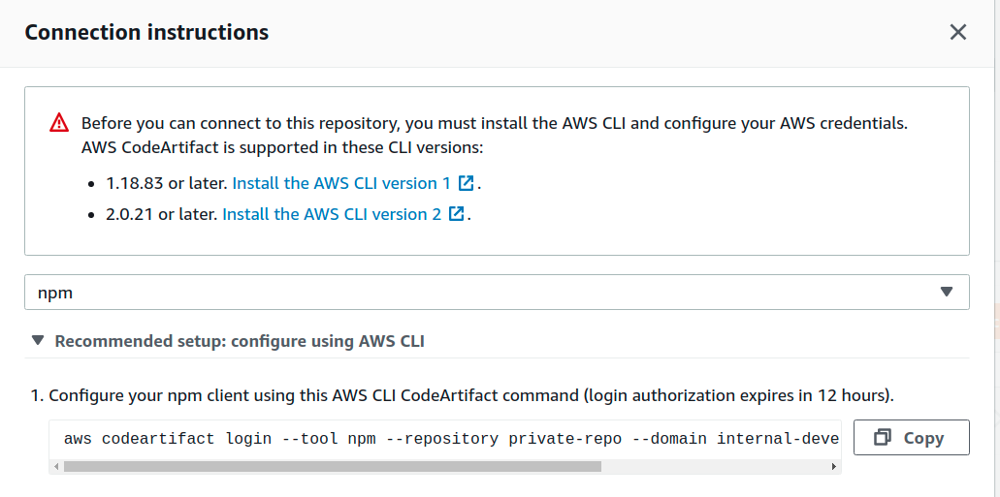
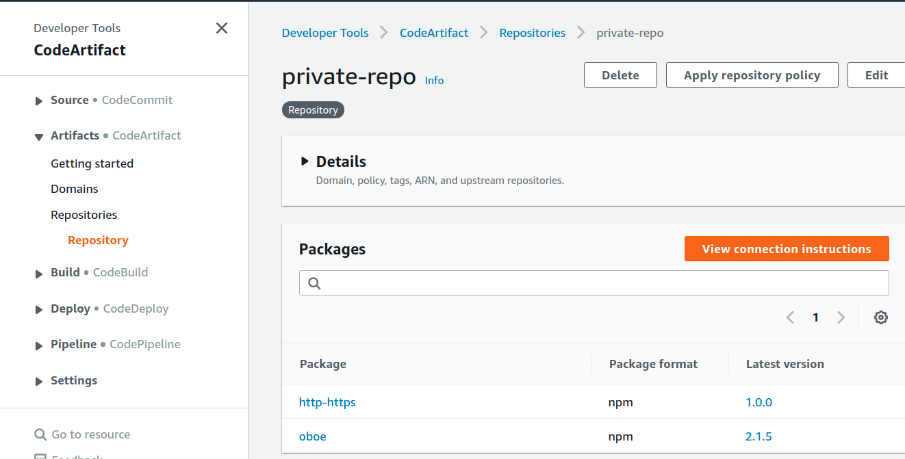

# simple-codeartifact-cloudformation
A simple Cloudformation for building a useful Code Artifact for hosting and caching modules.

##  Get Code

```bash
git clone git@github.com:bwinkers/simple-codeartifact-cloudformation.git
```

## Change in the repo directory

```bash
cd simple-codeartifact-cloudformation
```

## Verify the file

```bash
aws cloudformation validate-template --template-body file://template.yaml
{
    "Parameters": []
}
```

## Deploy the stack

```bash
aws cloudformation deploy --template-body file://template.yaml --stack-name private-repo-stack
```

## Get Login instructions from AWS Console

Login to the console and view Code Artifact to see your repos.


Click the big orange button to get connection info fot your package manager.



## Auth for Javascript

```bash
aws codeartifact login --tool npm --repository private-repo --domain internal-development --domain-owner xxxxxxxxxx
```

## Auth for Python

```bash
aws codeartifact login --tool pip --repository private-repo --domain internal-development --domain-owner xxxxxxxxxx
```

## View packages in repo

